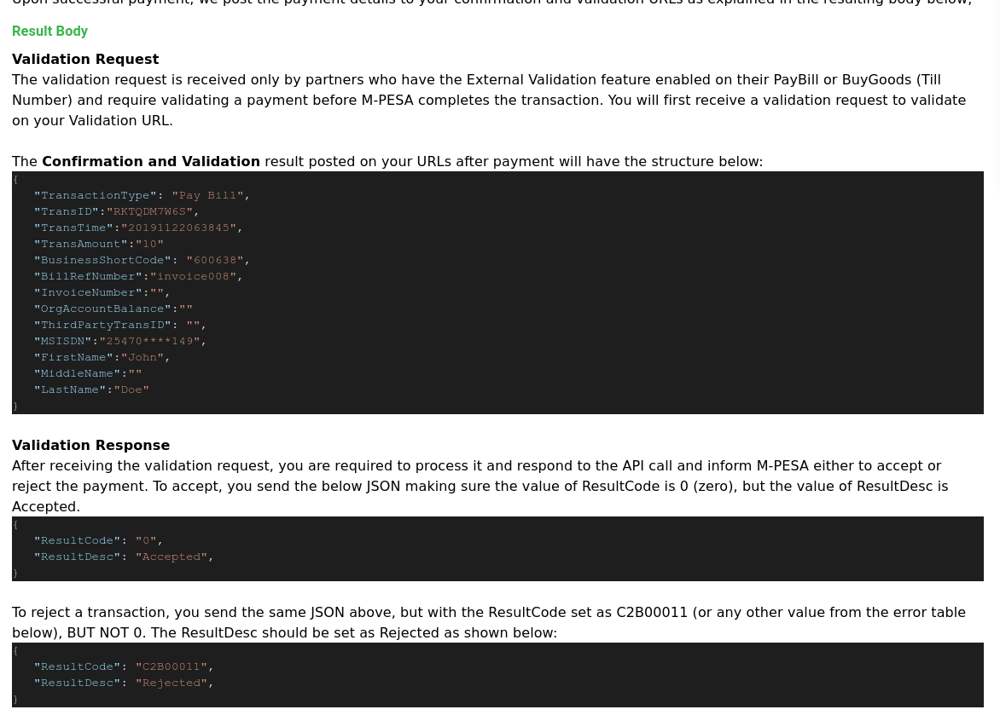
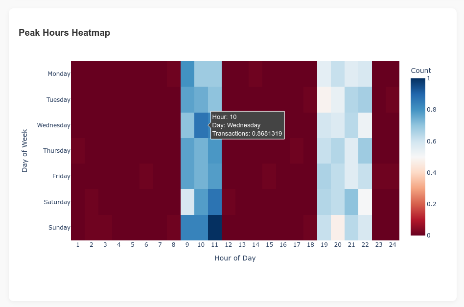
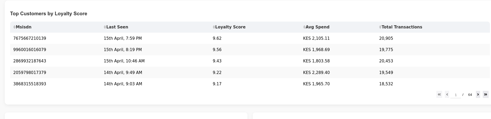
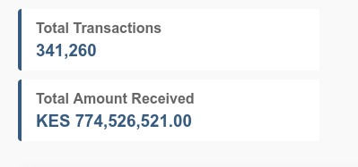
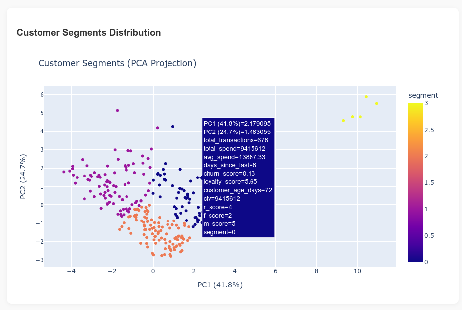
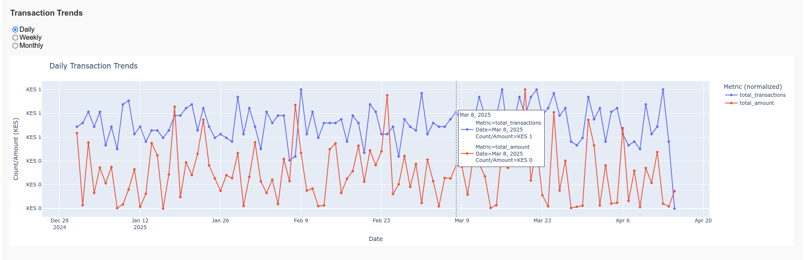

# M-Pesa Transaction Analytics Pipeline

## Overview

A scalable, containerized analytics pipeline for processing M-Pesa transaction data (Paybill and Buy Goods) using the [M-Pesa Daraja API](https://developer.safaricom.co.ke/APIs/CustomerToBusinessRegisterURL). Designed to help businesses track customer behavior, extract valuable business insights, and analyze transaction trends. 

This pipeline processes real-time M-Pesa transaction data, calculates customer loyalty scores, tracks peak transaction hours, and visualizes transaction trends. The resulting analytics help businesses make data-driven decisions and understand their customer segments better.

## Business Need

With the growing usage of M-Pesa as a mobile payment platform, businesses need advanced analytics to understand customer behaviors and identify growth opportunities. The solution is designed to address the following business needs:

1. **Customer Insights**: Identify repeat customers, track their spending patterns, and calculate Customer Lifetime Value (CLTV).
2. **Business Performance**: Measure the total transaction value and identify peak hours for transactions, helping businesses optimize their operations.
3. **Customer Segmentation**: Segment customers based on their transaction behavior and loyalty to tailor personalized marketing strategies.
4. **Marketing Strategy**: Enhance customer engagement by identifying loyal customers and providing targeted offers during peak transaction hours.

## Features

- **Peak Hours Heatmap**: Visualize the busiest hours of the day/week based on transaction data to optimize operations and marketing efforts.
- **Top Customers by Loyalty Score**: Rank customers based on their loyalty, helping businesses identify their most valuable customers.
- **Basic Metrics**: Track and display total transactions, total amount received, and other key performance indicators.
- **Customer Segment Distribution (PCA)**: Use Principal Component Analysis (PCA) to group customers based on their transaction patterns, providing insights into different customer segments.
- **Transaction Trends**: Visualize the trends of total transaction values over time, including peak periods and overall growth.

## Technical Approach

I designed the pipeline to be scalable and flexible, processing M-Pesa transaction data from Paybill and Buy Goods services using the M-Pesa Daraja API. It follows a batch processing approach using Apache Airflow, which handles the scheduling and orchestration of ETL (Extract, Transform, Load) tasks.

The pipeline uses the actor model, where each major component of the ETL process (such as data extraction, transformation, and loading) is treated as an independent "actor" that can run asynchronously and handle tasks in isolation. With this model, One can maintain individual components without impacting the entire pipeline.

### Architecture

1. **M-Pesa Daraja API Integration**: The system pulls transaction data from the M-Pesa Daraja API, including Paybill and Buy Goods transactions, in real time. Check [daraja API docs](https://developer.safaricom.co.ke/APIs/CustomerToBusinessRegisterURL)
2. **ETL Pipeline**: The transaction data is batch processed through an Extract-Transform-Load (ETL) pipeline, ensuring clean and usable data for analytics. While I use Apache Airflow to handle scheduling and orchestration of the tasks, the Akka framework provides actor-based concurrency in some processing stages.
3. **Data Storage**: All processed data is stored in a PostgreSQL database for easy querying and analysis.
4. **Analytics & Machine Learning**:
   - **Customer Segmentation**: I use PCA for customer segmentation based on transaction behaviors.
   - **Loyalty Scoring**: I use [RFM analysis](https://mailchimp.com/resources/rfm-analysis/) to calculate customer loyalty scores based on the frequency and volume of transactions.
   - **Time Series Analysis**: Transaction trends and patterns are visualized over time.
5. **Data Visualization**: For this, I went for Plotly Dash since it provides an interactive view of key metrics like peak hours, top customers, and transaction trends.

### Technologies Used

- **Python**: The core programming language for the pipeline, using libraries like Pandas, NumPy, and Scikit-learn for data processing and analysis.
- **Airflow**: Used for orchestrating the ETL pipeline and ensuring that data processing tasks run on schedule.
- **Akka**: Implements the actor model for concurrent, distributed processing within the ETL pipeline, enhancing modularity, fault tolerance, and scalability.
- **PostgreSQL**: Relational database used for storing transaction data.
- **Plotly Dash**: Used to build interactive dashboards for visualizing key metrics and insights.
- **Docker**: Containerization of the entire application, allowing for easy deployment and scaling.
- **Uvicorn & FastAPI**: Fast and efficient web frameworks used to serve the APIs and web dashboards.

### Data Flow

1. **Data Extraction**: The M-Pesa Daraja API is called to fetch transaction data, including Paybill and Buy Goods transactions.
2. **Data Transformation**: The raw transaction data is cleaned, transformed, and enriched for further analysis (e.g., calculating loyalty scores).
3. **Data Loading**: The cleaned data is loaded into a PostgreSQL database for storage and querying.
4. **Analytics**: Basic models are applied to calculate loyalty scores, identify customer segments, and generate transaction trends.
5. **Visualization**: Dashboards are created to visualize the key metrics and insights for business decision-making.

## Screenshots

### Mpesa Transaction API Request

The confirmation and validation requests are posted to our registered url everytime a customer makes a **Paybill** or **Buy Goods** transaction to our organization

Here are a few visualizations generated by the pipeline:

### Peak Hours Heatmap

- This heatmap shows the peak transaction hours, helping businesses optimize operations by focusing resources on high-demand times.

### Top Customers by Loyalty Score

- A ranking of customers based on their loyalty score, identifying those who contribute the most to business revenue.

### Basic Metrics
- **Total Transactions**: A summary of the total number of transactions over time.
- **Total Amount Received**: The total value of transactions, helping businesses measure their revenue growth.
- **Customer Segment Distribution (PCA)**: A scatter plot that shows how customers are distributed across different segments based on their transaction behaviors.

### Transaction Trends
                                                                                                                      
- A time-series graph showing transaction trends over a specified period, highlighting growth or decline in business performance.

## Next Steps
#### Register Your URLs with the M-Pesa Daraja API
- I was using the sandbox environment and generated many fake requests to populate my database and simulate a batch process. I need to Deploy the application and register my confirmation and validation URLs with Safaricom’s Daraja API. This allows the system to receive real-time transaction callbacks for Paybill and Buy Goods.

#### Initialize the Database
- Before starting the application, and after making sure our PostgreSQL server is running, we need to initialize the database with the required schema

        python db/setup.py     